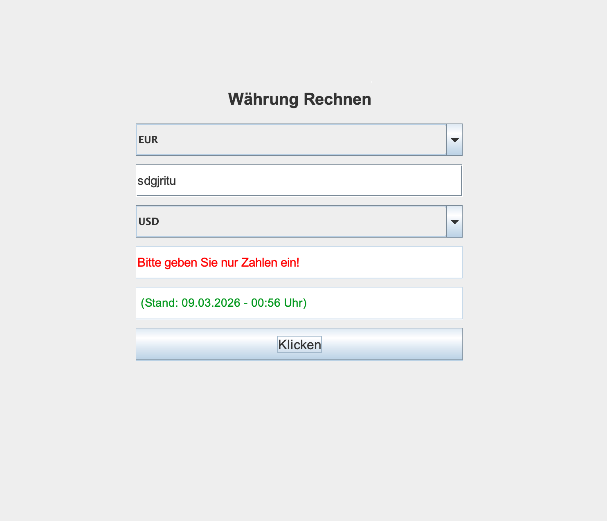
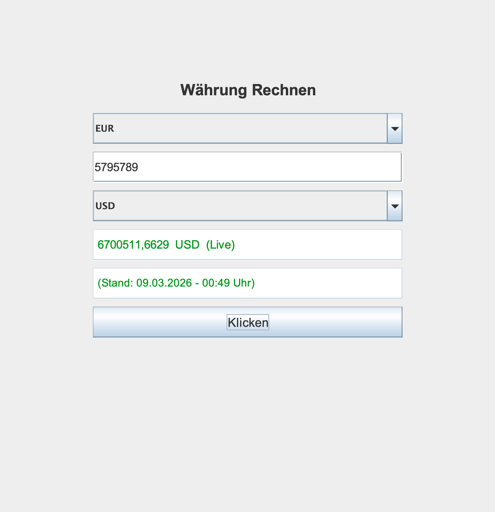
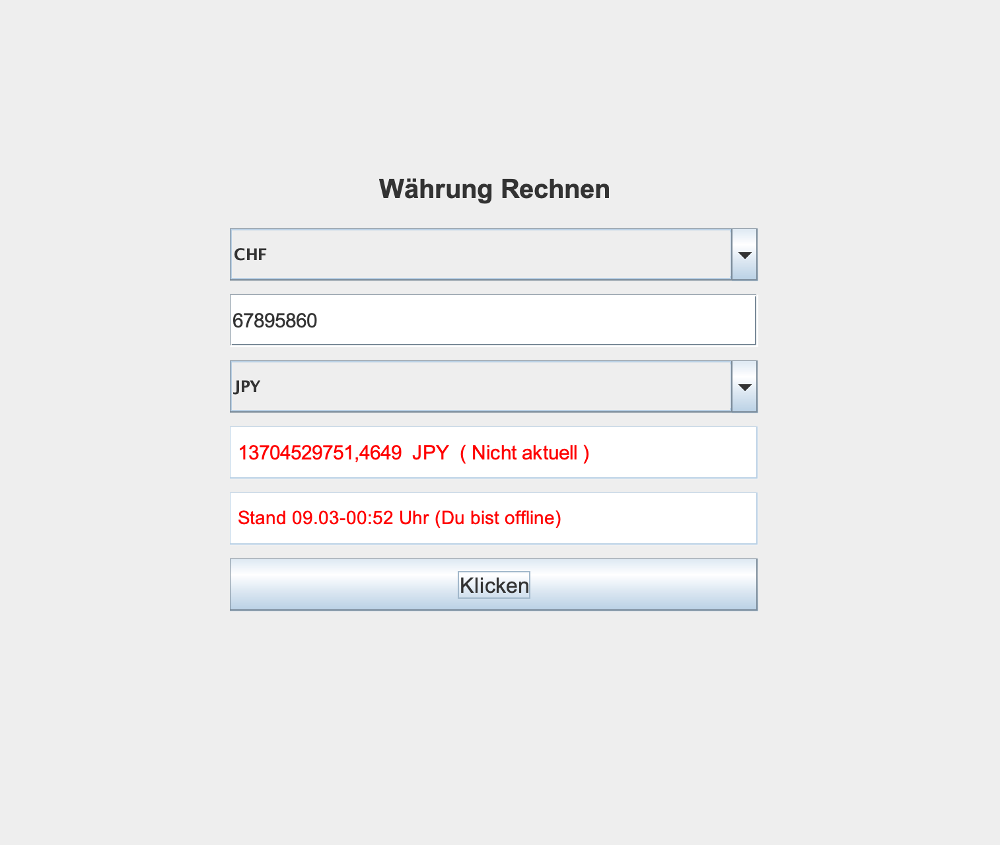

# 💱 Currency Converter (Java)

Ein effizienter Währungsrechner mit **Echtzeit-Kursen** und **intelligentem Offline-Cache**.

## ✨ Features (Deutsch)
* **Robustheit:** Die App ist absturzsicher! Bei falschen Eingaben (Buchstaben statt Zahlen) stürzt das Programm nicht ab, sondern gibt klare Anweisungen.
* **Live-Daten:** Nutzung einer API für aktuelle Wechselkurse.
* **Offline-Modus:** Funktioniert dank GSON-Caching auch ohne Internet.

## ✨ Features (English)
* **Crash-Proof:** Handles invalid inputs (letters or symbols) gracefully without crashing.
* **Real-time Rates:** Integrated API for up-to-date currency data.
* **Smart Caching:** GSON-powered offline mode for conversions without internet access.

## 📸 Screenshots
Startseite des Apps / App home screen.

Fehlermeldung bei Enigabe von Buchstaben / Error message when entering letters.

Rechenen von Währungen im Online Status / Currency conversion in online status. 

Rechenen von Währungen im Offlinee Status / Currency conversion in offline mode.

## 🛠 Setup
Das Projekt nutzt **Maven**. Einfach in IntelliJ öffnen – alle Abhängigkeiten (GSON) laden automatisch!
